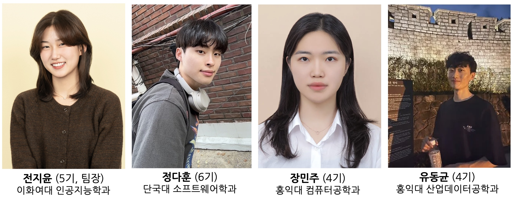
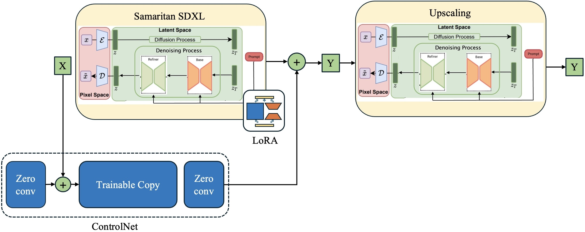
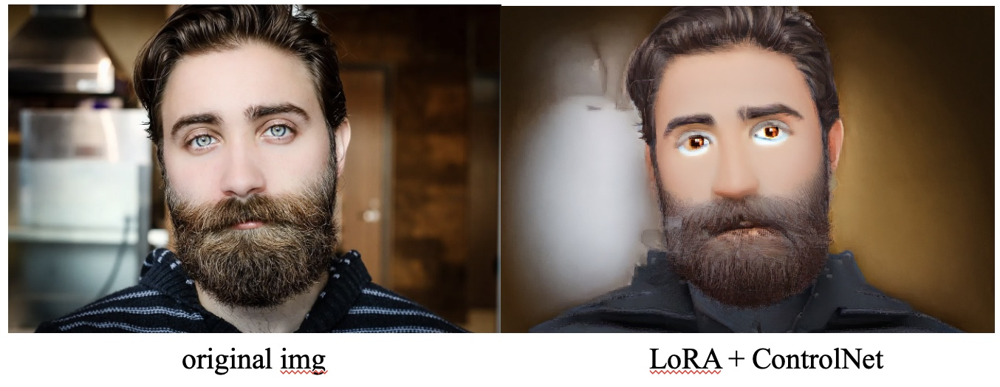

# 😀 MY MEMOJI 
# | Introduction <br>
**My Memoji**는 **유저 사진을 input으로 그와 닮은 memoji를 생성해주는 서비스**입니다. <br>
SDXL을 finetuning하고, 독립적인 ldm을 사용하여 post-hoc img2img 성능을 개선하였습니다. 더하여, React를 사용해 custom ui를 빌드하였습니다.<br>
📄 [Visit our notion for more detail!](https://sparkly-onion-be7.notion.site/My-Memoji-16f8e2ec5d7a81cea547f92474f83cd0?pvs=4)
<br><br>
### 🔥 Motivation <br>
미모지는 사용자가 자신을 닮은 맞춤형 캐릭터를 만들 수 있도록 도와주는 Apple의 앱입니다.
하지만, 미모지를 만들 때 지정할 수 있는 스타일에 한계가 있기에 나와 닮게 만들기 힘들다는 문제점이 있습니다.<br>
저희는 이러한 문제점을 바탕으로, 사진을 찍으면 나와 닮은 미모지를 자동으로 생성해주는 프로젝트를 진행해보기로 하였습니다.

### 👥 Members
<br><br>

# | Installation <br>
### SD WebUI
MyMemoji의 UI는 automatic1111을 활용하여 작성되었습니다. 따라서, MyMemoji webUI를 실행하기 전에, automatic1111에서 적절한 환경설정이 필요합니다. <br>

**1. Clone the repo**<br>
```
git clone https://github.com/AUTOMATIC1111/stable-diffusion-webui
```
<br>

**2. Download models**<br>
➡️ checkpoint for ControlNet : [diffusers_xl_canny_full.safetensors](https://huggingface.co/lllyasviel/sd_control_collection/blob/main/diffusers_xl_canny_full.safetensors)<br>

➡️ [Download our model checkpoints here](https://drive.google.com/drive/folders/10c-bRDNM-EAHATRaCPTQ3ZGfspJUgASs)<br>
- checkpoint for finetuned Samaritan SDXL : `./Lora/memoji-07.safetensors`<br>
- checkpoint for additional ldm : `./Stable-diffusion/samaritan3dCartoon_v40SDXL.safetensors`<br><br>


**3. Set up files**<br>
다운로드한 모델 파일 위치를 다음과 같이 조정합니다.

```
└──...── extentions/
│        └── sd-webui-controlnet/
│           └── models/
│              └── diffusers_xl_canny_full.safetensors
│                            
└──...── models/           
│        └── Stable-diffusion/        
|            └── samaritan3dCartoon_v40SDXL.safetensors
│        └── Lora/        
|            └── memoji-07.safetensors
|
```
<br>

**4. Set up api**<br>
`webui-user.bat`코드를 다음과 같이 수정합니다.
```
@echo off

set PYTHON=
set GIT=
set VENV_DIR=
set COMMANDLINE_ARGS=--api

call webui.bat
```
<br>

**5. Run SD WebUI**<br>
```
./webui.sh --api
```
<br>

### MyMemoji WebUI 
**1. Clone the repo**<br>
```
git clone https://github.com/alswn-03/emoji-generation-webui
```
<br>

**2. Run MyMemoji WebUI**<br>
```
npm start
```
<br>

# | How to use MyMemoji WebUI <br>
1️⃣ 이모지 생성을 원하는 사진을 업로드합니다. <br>
2️⃣ Input 이미지에 맞게 Gender와 Face를 선택합니다.<br>
3️⃣ (optional) email란에 본인 이메일 주소를 입력하면, 생성이미지가 해당 주소로 전송됩니다. <br>
4️⃣ **Generate** 버튼을 누릅니다.<br>
✅ **Progress bar**가 100%가 될 때까지 기다리면 끝!!<br>
<br><br>

    
# | Model Description
<br>

### 1. base model : <br>
[Samaritan-3d-Cartoon-SDXL](https://huggingface.co/imagepipeline/Samaritan-3d-Cartoon-SDXL)<br>
최대한 프로젝트 목적에 맞는, cartoon 화풍을 가진 모델로 선정했습니다. <br><br>
<br><br>
  
### 2. 원하는 그림체 만들기 (LoRA finetuning)<br>
Vanilla Samaritan SDXL은 cartoon 화풍을 보여주긴 했지만, 원하는 emoji 화풍과는 거리가 있다고 판단하여<br>
총 2748개의 preprocessed data를 사용해 LoRA finetuning을 진행하였습니다.<br><br>
<br><br>
🚨 **원하는 스타일이 적용되긴 했지만, 원본 이미지 속 인물과 표정 및 자세가 일치하지 않는다는 문제점 발견을 발견했습니다.**<br><br>


### 3. 원본 이미지에 충실하기 (ControlNet w/ Canny Edge)<br>
2에서 생긴 문제점을 해결하기 위해서 입력 이미지의  edge 정보를 활용하기로 결정하여 <br>
Controlnet w/ canny edge를 활용하여 입력 이미지의 edge 정보를 반영하여 생성했습니다.<br><br>
<br><br>
🚨 **원본 이미지 속 인물의 윤곽을 잘못 인식하여 생성 이미지에 unwanted artifacts가 나타나는 것을 발견할 수 있었습니다.** <br>
(위 예시의 경우, 사진 속 인물의 쌍꺼풀과 애굣살까지 눈으로 인식해버림)<br><br>


### 4. 더 부드러운 결과물 얻기<br>
3에서 생긴 문제점을 해결하기 위해서, 독립적인 ldm을 추가로 사용하여 post-hoc img2img 성능을 개선하였습니다.<br>
Empirical한 이유로, 추가 ldm은 vanilla 모델을 사용하였습니다.<br>
- 추가 ldm의 역할 :  
    - 3에서의 artifact를 덮어버림  
    - upscaling을 통한 이미지 해상도 향상<br><br>
    
<br><br>
✅ **원본 이미지의 윤곽을 반영하면서, 원하는 화풍이 적용된 이미지 생성 성공 !**  <br><br>


